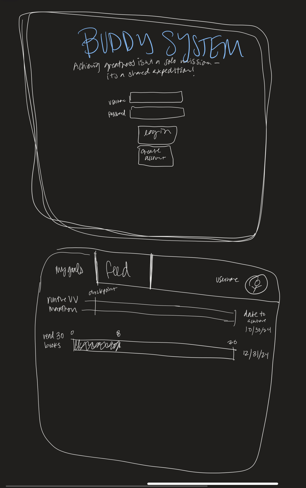
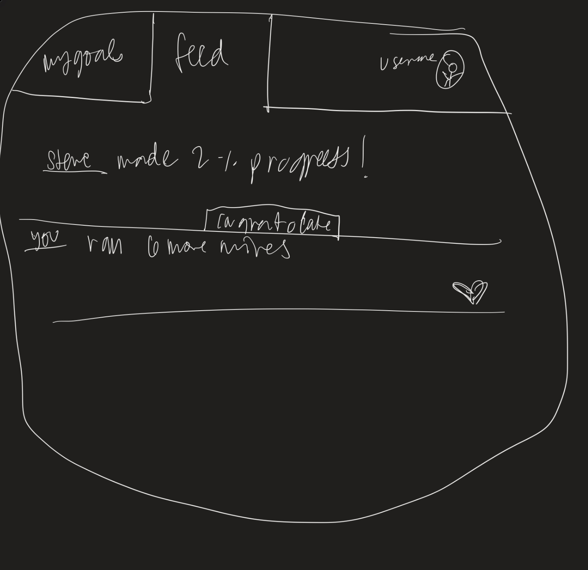

# Buddy System

## Elevator Pitch

Picture this: a web application designed to transform your journey to success into a collaborative adventure. Whether you're striving for fitness milestones, boosting productivity, or diving into personal development, Buddy System has got your back.
Imagine setting and tracking your goals effortlessly with interactive habit streaks, making progress feel like a game. But here's the twist – you're not alone on this journey. Stay in the loop with your friends' achievements through personalized notifications, creating a tight-knit community of mutual support.
Because achieving greatness is not a solo mission – it's a shared expedition. Elevate your aspirations, celebrate victories, and conquer challenges together with Buddy System. Because with a buddy by your side, success is not just a destination – it's an incredible journey!

## Design

## Key Features

- Secure login over HTTPS
- ability to check that user did the habit that day
- display of streak length
- ability to track goal progress
- ability to connect with friends
- goal progress consistently stored

## Technologies

I will use these technologies in these ways:

- **HTML** - 3 HTML pages: 1 for user goals, 1 leaderboard of friends, one for login
- **CSS** - Mobile first styling, responsive site so that it looks good on different screen sizes, uses good whitespace, color choice and contrast
- **JavaScript** - provides login, displays other users,
- **Service** - backend service with endpoints for:
  - login
  - keeping goal progress
  - habit streak
  - receiving goals
- **DB/Login** - register and login users, credentials securely stored in database
- **WebSocket** - as progress toward a goal is made, their streak and progress will be broadcast to the user's friends
- **React** - Application will use next.js as the web server with react for HTML CSS and JS

## HTML Startup Deliverable

I guess this is what the assignment should look like. but below this is more description of the changes I made by page.

- **HTML pages** - 4 HTML pages: Index, feed, goals, and profile
- **Links** - all pages link to each other so user can navigate through the pages easily
- **Text** - there is placeholder text in several spots
- **Images** - new images on feed, goals, and profile pages
- **DB/Login** - input boxes for username and password. placeholder for goals and buddies that will be in database.
- **WebSocket** - all users buddies' activities broadcast on the feed page via websocket.

### more descriptive HTML Startup deliverable by HTML page

- **Index.html page**
  - added username and password boxes
  - added a create account button
  - header 2 is now the BuddySystem catchphrase thing
  - links to all pages in application in navbar
- **Feed.html page**
  - new image
  - Username is the placeholder for the users username. the page will be customized for user " Username's feed"
  - Placeholders for all user's buddies' activities via websocket
  - placeholder for motivational quotes about habits pulled from API
  - Comment for button to celebrate buddies habit streaks
- **Goals.html page**
  - new image
  - placeholder for goals stored in database
  - placeholder for buddies who are working with you on that goal will be stored with database
  - placeholder for number of days in habit streak stored in database
- **profile.html page**
  - new image
  - placeholder for Avatar, username, name, and list of buddies stored in database

### Notes

[notes](/notes.md)
